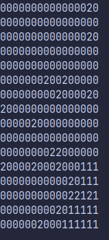

---
header-includes:
 - \usepackage{fvextra}
 - \DefineVerbatimEnvironment{Highlighting}{Verbatim}{breaklines,commandchars=\\\{\}}
 - \usepackage[margin=1cm]{geometry}
---

# Sztuczna inteligencja - lista 2

### Mateusz Polito 266581

## 0. Informacje ogólne

Jako język programowania wybrałem Rust.
Biblioteki użyte: [Rand](https://docs.rs/rand/latest/rand/) do losowych liczb  

## 1. Implementacja gry Halma

Stan gry przechowywany jest w typie Board, który jest tablicą enumów Tile. Każdy Tile może mieć 3 stany:
- pusty
- gracz czarny (1)
- gracz biały (2)

```rust
pub enum Tile {
    Empty,
    Black,
    White,
}
pub type Board = [[Tile; 16]; 16];
```
Oprócz samej planszy, aby opisać stan gry, stworzyłem enum GameState, który dodatkowo przechowuje informację o graczu, który doprowadził grę do danego stanu.

```rust
pub enum GameState {
    Start(Player),
    Moved(Player),
    Won(Player),
}
```

## 2. Generacja drzewa gry

Jako jeden węzeł drzewa gry stworzyłem strukturę DecisionTreeNode. Przechowuje ona aktualną planszę, opis stanu gry, listę powiązaych dzieci, oraz pomocniczą zmienną która opisuje, czy dzieci zostały już wygenerowane (optymalizacja dla minimax).

```rust
pub struct DecisionTreeNode {
    pub board: Board,
    pub game_state: GameState,
    pub children: Vec<DecisionTreeNode>,
    pub generated: bool,
}
```
Najważniejszą funkcją działającą na `DecisionTreeNode` jest funkcja generująca wszystkie możliwe ruchy dla danego stanu gry.  
Na początek sprawdza ona dla każdego koordynatu planszy, czy należy do ruszającgo się gracza.  
Jeśli tak, to najpierw generuje ona wszystkie możliwe ruchy nie używające skoków, czyli przesuwa pionek o koordynaty opisane w liście pomocniczej `DIRECTIONS`. 
Ostatnim etapem jest wygenerowanie ruchów, które wymagają skoków, za pomocą funkcji `generate_valid_jumps_for_point` (widoczna poniżej w kodzie).
Dodatkowo, jeżeli pionek znajduje się w obozie przeciwnika (lista koordynatów `my_winning_coords`), to zezwala ruchy tylko w obrębie tego obozu, zgodnie z zasadami Halma.  

```rust
impl DecisionTreeNode {
    pub fn generate_children(&mut self, player_moving: Player) {
        self.generated = true;
        for y in 0..16 {
            for x in 0..16 {
                let from_coords = Coords { x, y };
                let my_winning_coords = match player_moving {
                    Player::Black => PLAYER_BLACK_WINNING,
                    Player::White => PLAYER_WHITE_WINNING,
                };
                //only move the current player's tiles
                if self.is_tile_mine(from_coords, player_moving) {
                    //check all 8 possible dirctions
                    for direction in DIRECTIONS.into_iter() {
                        let move_to = Coords {
                            x: x + direction.x,
                            y: y + direction.y,
                        };

                        if move_to.is_in_board() {
                            //normal moves
                            if self.is_tile_empty(move_to) {
                                if my_winning_coords.contains(&from_coords) {
                                    if my_winning_coords.contains(&move_to) {
                                        self.add_child_node(from_coords, move_to, player_moving);
                                    }
                                } else {
                                    self.add_child_node(from_coords, move_to, player_moving);
                                }
                            //jumping
                            } else {
                                let jump_to = Coords {
                                    x: move_to.x + direction.x,
                                    y: move_to.y + direction.y,
                                };
                                if jump_to.is_in_board() {
                                    if self.is_tile_empty(jump_to) {
                                        let mut jump_points: Vec<Coords> = vec![jump_to];
                                        self.generate_valid_jumps_for_point(
                                            &mut jump_points,
                                            jump_to,
                                            direction,
                                        );
                                        for jump_point in jump_points {
                                            if my_winning_coords.contains(&from_coords) {
                                                if !my_winning_coords.contains(&jump_point) {
                                                    continue;
                                                }
                                            }
                                            self.add_child_node(
                                                from_coords,
                                                jump_point,
                                                player_moving,
                                            );
                                        }
                                    }
                                }
                            }
                        }
                    }
                }
            }
        }
    }
    fn generate_valid_jumps_for_point(
        &self,
        jumps: &mut Vec<Coords>,
        point: Coords,
        previous_direction: Coords,
    ) {
        for direction in DIRECTIONS {
            if direction != previous_direction {
                let check_point = Coords {
                    x: point.x + direction.x,
                    y: point.y + direction.y,
                };
                if check_point.is_in_board() {
                    if !self.is_tile_empty(check_point) {
                        let jump_to_point = Coords {
                            x: check_point.x + direction.x,
                            y: check_point.y + direction.y,
                        };
                        if jump_to_point.is_in_board() {
                            if self.is_tile_empty(jump_to_point) {
                                if !jumps.contains(&jump_to_point) {
                                    jumps.push(jump_to_point);
                                    self.generate_valid_jumps_for_point(
                                        jumps,
                                        jump_to_point,
                                        direction,
                                    );
                                }
                            }
                        }
                    }
                }
            }
        }
    }
}
```

## 3. Implementacja minimax i alfa-beta cięcia

Funkcja `minimax` jest wywoływana z następującymi argumentami:
- pierwszy węzeł drzewa decyzyjnego
- maksymalna głębokość dla każdej iteracji funkcji wewnętrznej (używam 2)
- heurystyka (funkcja implementująca cechę `Heuristic`)
- opcjonalny limit rund po którym funkcja zewnętrzna zakończy działanie, inaczej działa do pierwszej wygranej
- poziom logowania (nic, numer rundy, lub numer rundy wraz z informacją o wybranym ruchu)
- pierwszy gracz

```rust
pub fn minimax(
    node: &mut DecisionTreeNode,
    max_depth: u32,
    heuristic: &mut impl Heuristic,
    rounds_limit: Option<u32>,
    log_level: LogLevel,
    mut player: Player
)
```

Następnie funkcja `minimax` wywołuje wewnętrzną rekurencyjną funkcję `minimax_inner`. Jedno takie wywołanie odpowiada jednej turze gry.  
Funkcja wewnętrzna jest wywoływana dopóki nie zostanie osiągnięty limit rund, lub gdy zwróci węzeł drzewa mówiący o wygranej któregoś z graczy.

### Budowa funkcji wewnętrznej minimax_inner:  

Typ zwracany przez tą funkcję to enum `MinMaxResult`. Ma on 2 możliwe stany:
- Eval - określa heurystyczną ewaluację stanu gry oraz indeks wybranego węzła w tablicy dzieci rodzica
- Leaf - zwraca kopię wygrywającego węzła, oraz głębokość, na której została znaleziona (ponieważ oznacza to, ile rund musimy dodać)

```rust 
enum MinMaxResult {
    Eval(f32, usize),
    Leaf(DecisionTreeNode, u32),
}
```
Teraz przejdę do działania funkcji:  
Na początku sprawdzamy, czy osiągneliśmy maksymalną głębokość rekurencyjnych wywołań. Jeżeli tak, zwracamy heurystyczną ewaluację stanu gry z perspektywy aktualnego gracza.


```rust
fn minimax_inner(
    node: &mut DecisionTreeNode,
    current_depth: u32,
    heuristic: &mut impl Heuristic,
    node_index: usize,
    maximizing: bool,
    player: Player,
) -> MinMaxResult {

    if current_depth == 0 {
        return MinMaxResult::Eval(heuristic.evaluate(&node.board, player), node_index);
    }

```

Potem zostaje wybrany gracz dla dzieci danego węzła

```rust
 let next_player = match node.game_state {
    GameState::Start(player) => player,
    GameState::Moved(player) => player.other(),
    GameState::Won(_) => {
        return MinMaxResult::Leaf(node.clone(), current_depth);
    }
};   
```
Następnie, ustawiam wartość maksymalizacji/minimalizacji tak, aby na pewno była mniejsza/większa od ewaluacji heurystyk.

```rust
let mut max_eval: f32 = match maximizing {
    true => f32::NEG_INFINITY,
    false => f32::INFINITY,
};
```
Jeżeli ten węzeł nie ma jeszcze wygenerowanych dzieci, to je generuję.
```rust
if !node.generated {
    node.generate_children(next_player);
}
```

Jeżeli węzeł po generacji nie ma dzieci, to poszło coś nie tak, a więc zatrzymuję program.

```rust
if node.children.len() == 0 {
    println!("Node with no children found! {}", &node);
    println!("Ensuring generation");
    node.generate_children(next_player);
    panic!("{}", &node);
}
```
Następnie wchodzę do pętli, która dla dzieci wywołuje rekurencyjnie funkcję `minmax_inner`, po czym wybiera stan gry z najlepszą oceną, lub zwraca dziecko z wygraną grą.

```rust
let mut max_child_index = 0;
let mut child_index = 0;

for mut child in &mut node.children {
    let minmax_inner_result = minimax_inner(
        &mut child,
        current_depth - 1,
        heuristic,
        child_index,
        !maximizing,
        player,
    );
    match minmax_inner_result {
        MinMaxResult::Eval(child_eval, _) => match maximizing {
            false => {
                if max_eval > child_eval {
                    max_eval = child_eval;
                    max_child_index = child_index;
                }
            }
            true => {
                if max_eval < child_eval {
                    max_eval = child_eval;
                    max_child_index = child_index;
                }
            }
        },
        MinMaxResult::Leaf(_, _) => return minmax_inner_result,
    }

    child_index += 1;
}

return MinMaxResult::Eval(max_eval, max_child_index);
```

### Alfa-beta - różnice względem minimax

Dodatkowe parametry `alfa` i `beta` w funkcji wewnętrznej:

```rust
fn alfa_beta_inner(
    node: &mut DecisionTreeNode,
    current_depth: u32,
    heuristic: &mut impl Heuristic,
    node_index: usize,
    maximizing: bool,
    mut alfa: f32,
    mut beta: f32,
    player: Player,
) -> MinMaxResult
```

Sprawdzanie parametrów w pętli wybierającej dzieci, potencjalne przerwanie jeśli `beta <= alfa`
```rust
for mut child in &mut node.children {
    let minmax_inner_result = alfa_beta_inner(
        &mut child,
        current_depth - 1,
        heuristic,
        child_index,
        !maximizing,
        alfa,
        beta,
        player,
    );
    match minmax_inner_result {
        MinMaxResult::Eval(child_eval, _) => match maximizing {
            false => {
                if max_eval > child_eval {
                    max_eval = child_eval;
                    max_child_index = child_index;
                }
                if beta > child_eval {
                    beta = child_eval;
                }
            }
            true => {
                if max_eval < child_eval {
                    max_eval = child_eval;
                    max_child_index = child_index;
                }
                if alfa < child_eval {
                    alfa = child_eval;
                }
            }
        },

        MinMaxResult::Leaf(_, _) => return minmax_inner_result,
    }

    if beta <= alfa {
        break;
    }
    child_index += 1;
}
```

## 4. Heurystyki

Wszystkie heurystyki muszą spełniać cechę `Heuristic`, która zawiera jedną metodę `evaluate`
```rust
pub trait Heuristic {
    fn evaluate(&mut self, board: &Board, evaluating_player: Player) -> f32;
}
```

### Heurystyka losowa

Zwraca losową liczbę między -100 a 100.
```rust

pub struct HeuristicRandom {
    pub rng: ThreadRng,
}

impl Heuristic for HeuristicRandom {
    fn evaluate(&mut self, _board: &Board, _evaluating_player: Player) -> f32 {
        return self.rng.gen_range(-100.0..100.0);
    }
}
```

### Heurystyka na podstawie bliskości do rogu przeciwnika

Dla każdego gracza zdefiniowałem 2 tablice 16x16, gdzie do każdego pola przypisałem wartość odległości Manhattan do bazy przeciwnika.  
Następnie patrzę, gdzie stoją pionki danego gracza, i sumuję punkty dla tych pozycji.  
Wynik mnożę przez stałą, dla dopasowania do pozostałych heurystyk.

```rust

pub struct HeuristicProximity {
    pub power: f32,
}
impl Heuristic for HeuristicProximity {
    fn evaluate(&mut self, board: &Board, evaluating_player: Player) -> f32 {
        let mut score: f32 = 0.;
        //let mut score = 0.;
        match evaluating_player {
            Player::Black => {
                for y in 0..16 {
                    for x in 0..16 {
                        let tile = index_board(board, Coords { x, y });
                        if matches!(tile, Tile::Black) {
                            score += PLAYER_BLACK_HEURISTIC_PROXIMITY[y as usize][x as usize];
                        }
                    }
                }
            }
            Player::White => {
                for y in 0..16 {
                    for x in 0..16 {
                        let tile = index_board(board, Coords { x, y });
                        if matches!(tile, Tile::White) {
                            score += PLAYER_WHITE_HEURISTIC_PROXIMITY[y as usize][x as usize];
                        }
                    }
                }
            }
        }
        return (score * self.power).clamp(-100.0, 100.0);
    }
}
```

### Heurystyka na podstawie bliskości do rogu przeciwnika promująca pionek przodujący

Poprzednią heurystykę zmodyfikowałem, dając większą wagę dla najlepszego z pionków, i mniejszą dla pozostałych.  

```rust
pub struct HeuristicProximityWithSingle {
    pub single_power: f32,
    pub multi_power: f32,
}
```

Różnice w kodzie w stosumku do `HeuristicProximity`:  
Przechowywanie maksymalnej wartości pionka:

```rust
let mut max: f32 = f32::NEG_INFINITY;
```
W pętli ustawianie największej wartości:

```rust
if tile_ev > max {
    max = tile_ev;
}
```

Dodanie ważonej maksymalnej wartości pionka do wyniku:

```rust
score = score * self.multi_power + max * self.single_power;
```

### Heurystyka dodająca karę za stanie w swojej bazie

Modyfikacja heurystyki pierwszej

```rust
if PLAYER_WHITE_BASE.contains(&coord) {
    score -= self.discourage_power;
}
```

### Heurystyka złożona

Łącząca karę za zostawanie w bazie z promującą pionek przodujący

## 5. Porównanie Heurystyk

### Problem blokowania

W niektórych sytuacjach, szczególnie używając heurystyki losowej, występował następujący problem:



Pionki jednego z graczy jeszcze nie wyszły z bazy, podczas gdy drugi już do niej wszedł. Powodowało to, że pionki drugiego gracza nie mogły już wyjść, podczas, gdy gracz 1 nie mógł zdobyć tej bazy.

### Rozwiązanie

Napisałem funkcję, która będzie karać pionki za stanie blisko pionków drugiego gracza, które są w jego bazie.

```rust
fn dont_block_other_player_in_base(
    piece_coords: &Coords,
    other_player_base: &[Coords; 19],
    other_player_pieces: &[Coords; 19],
) -> f32 {
    let mut score = 0.;
    for direction in DIRECTIONS {
        let looking_at_coords = Coords {
            x: piece_coords.x + direction.x,
            y: piece_coords.y + direction.y,
        };
        if looking_at_coords.is_in_board() {
            if other_player_pieces.contains(&looking_at_coords) {
                if other_player_base.contains(&looking_at_coords) {
                    score -= 2.;
                }
            }
        }
    }
    return score;
}
```

## 6. Czas działania

### Minimax przy głębokości 2

| Heurystyka  | Czas   | Liczba rund |
|-------------|--------|-------------|
| Losowa      | 41.99s | 21211       |
| Odległość   | 1.52s  | 262         |
| Wiodący     | 1.33s  | 206         |


### Alfa-beta przy głębokości 1

| Heurystyka  | Czas  | Liczba rund |
|-------------|-------|-------------|
| Losowa      | 0.37s | 13816       |
| Odległość   | 0.01s | 262         |
| Wiodący     | 0.01s | 206         |

### Alfa-beta przy głębokości 2

| Heurystyka  | Czas   | Liczba rund |
|-------------|--------|-------------|
| Losowa      | 30.49s | 13843       |
| Odległość   | 0.83s  | 261         |
| Wiodący     | 0.69s  | 205         |

### Heurystyka vs heurystyka

Analiza przeprowadzana przy głębokości 3:  

W przypadku zestawienia z heurystyką losową, za każdym razem wygra heurystyka bardziej złożona.  
Odległość vs wiodący pionek: Wiodący (191 rund)  
Odległość vs zniechęcanie do siedzenia na starcie: Zniechęcanie (189 rund)  
Wiodący pionek vs zniechęcanie do siedzenia na starce: Wiodący (194 rund)  
Odległość vs Złożona: Złożona (193 rundy)  
Złożona vs Wiodący: Wiodący (192 rundy)  

### Głębokość 2 vs 3

Wprowadziłem optymalizację do mojego programu, gdzie dla każdego stanu planszy nie przechowuję całej tablicy planszy, a jedynie koordynaty pionków obu graczy.  
Pozwoliło mi to uruchomić niektóre algorytmy przy głębokości 3, chociaż nadal przy niektórych scenariuszach kończy mi się pamięć RAM.  
Przykładowo algorytm Odległość vs Wiodący, przy głębokości 2 rozgrywka kończy się po **231** rundach, a przy głębokości 3 już po **191**.  

## 6. Wnioski
Heurystyka z odległością manhatan okazała się dobrą bazą.  
Heurysytka z wiodącym pionkiem ją ulepszyła.  
Zniechęcanie do siedzenia na starcie działało lepiej niż zwykła odległość, jednak przegrywa z pionkiem wiodącym.  
Widać wyraźnie, że przycinanie alfa-beta dużo przyspiesza algorytm.  
W stosunku do poprzedniej wersji, udało mi się zoptymalizować użycie pamięci RAM, co poprawiło rezultaty w niektórych algorytmach.
